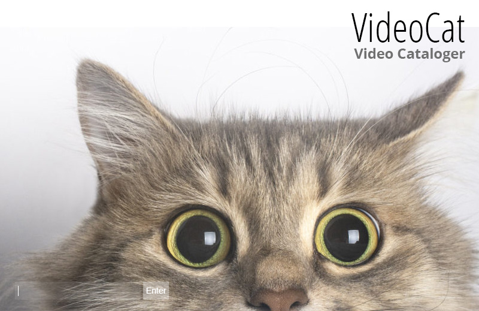

# VideoCat
 Video Cataloger

 

An Electron app to catalog my movie collection.  
## Features
- Import entire folder of movies.
- Thumbnails automatically generated by VirtualDub (Requires VirtualDub 64 bits and codecs for the movie formats you use).
- Specify thumbnails size and number.
- Search movies by star, score.
- Add stars (paste star picture, add name, birth place, birth date).
- Edit stars.
- Search stars.
- View star movies.
- View top-rated movies.
