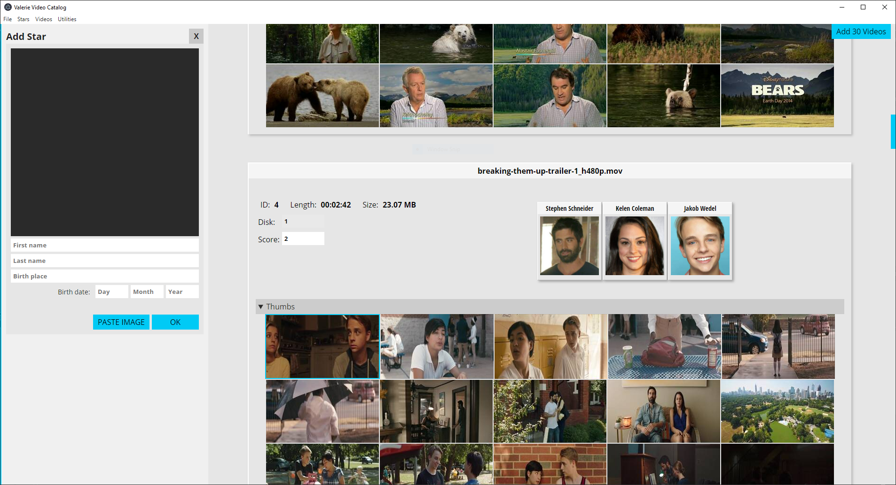
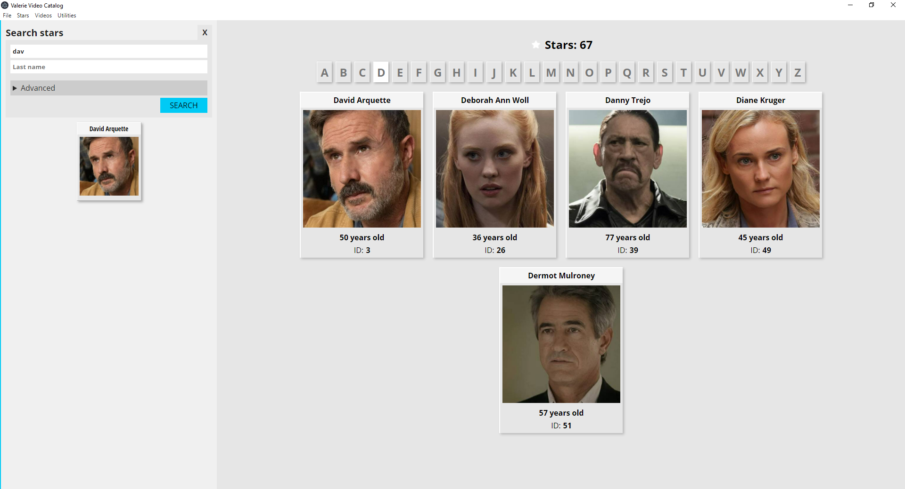
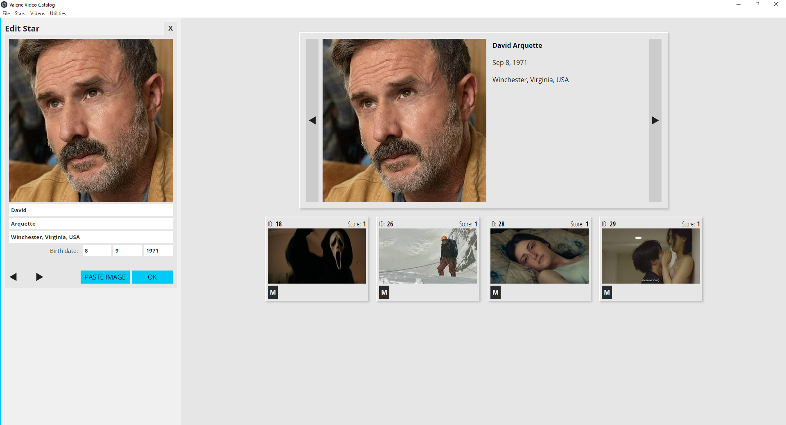
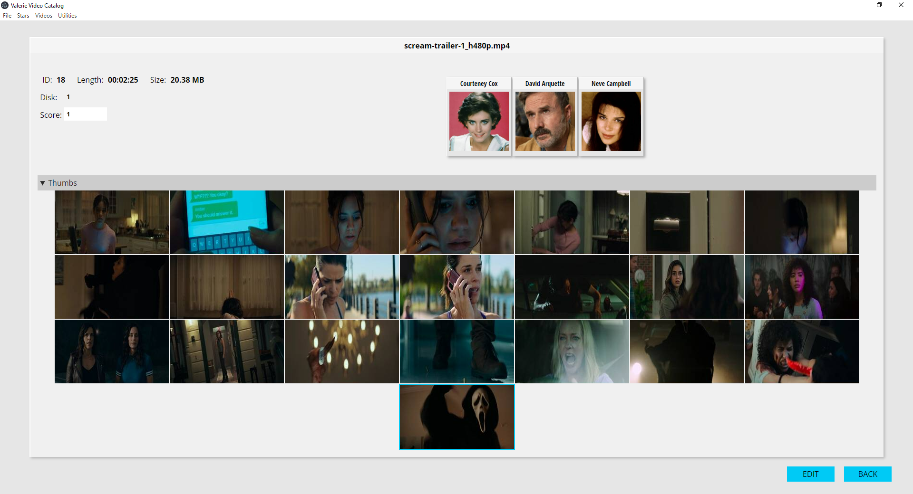
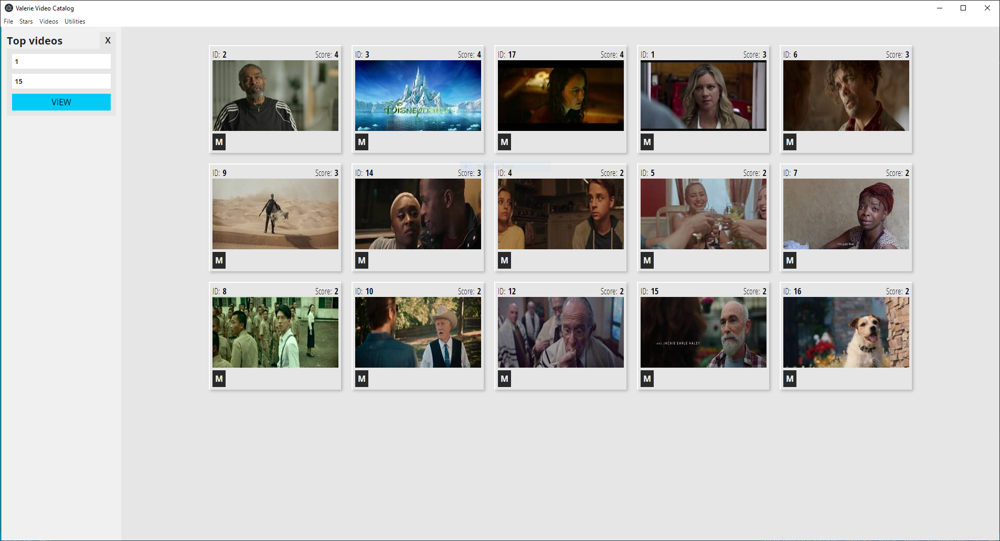

# VideoCat
 Video Cataloger

 

An Electron app to catalog my movie collection.  
## Features
- Import entire folder of movies.
- Thumbnails automatically generated by VirtualDub (Requires VirtualDub 64 bits and codecs for the movie formats you use).
- Specify thumbnails size and number.
- Search movies by star, score.
- Add stars (paste star picture, add name, birth place, birth date).
- Edit stars.
- Search stars.
- View star movies.
- View top-rated movies.

 
 
 
 
 

## To do
- Set first usage set up (create password). Currently working on password = 1234.
- Add tags functionality (was removed to refactor).
- Save modified videos (was removed to refactor).
- Create UI/UX!!!
- Incorporate backup functionality (was removed to refactor).
- Incorporate delete functionality (was removed to refactor).
- Play video directly from app?
